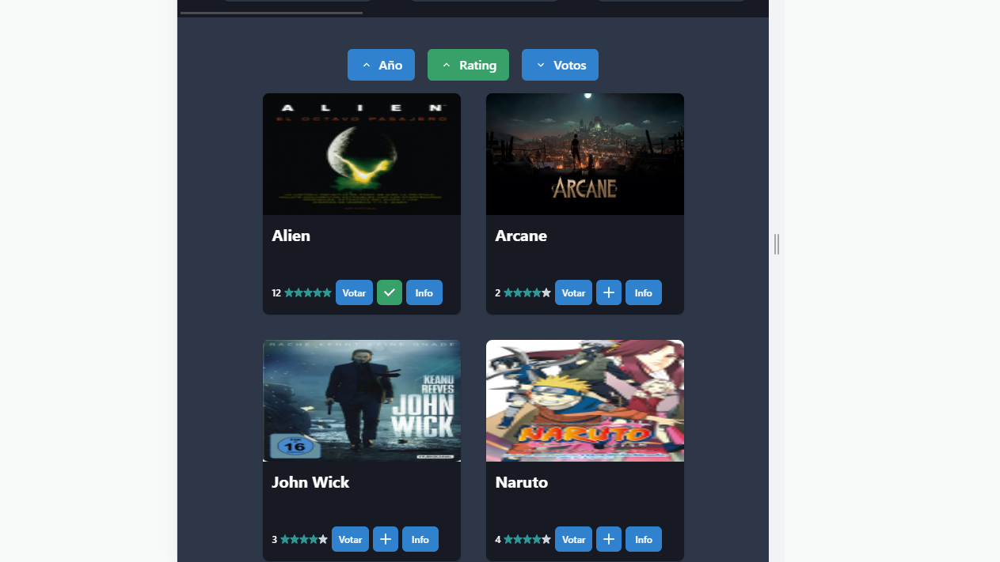

### Movie app: "NO-flix"

Es un aplicacion de React de peliculas y series donde puedes visualizar detalles, listar favoritas, agregar comentarios, y votar por un top semanal.

## Como usar la app

- Al inicio hay un banner donde cada vez que cagar la pagina, te sugiere una pelicula/serie aleatoria, con una breve informacion.

- Te muestra el ranking semanal, puedes votar por tu preferida y se verá reflejado automaticamente (manejado con redux)

- Puedes filtrar la lista completa por los parametros deseados

- Puedes agregar tus favoritas dandole al boton "+" (manejado con redux)

- Cada pelicula/serie tiene su caja de comentarios independiente, donde puedes dejar una pequeño comentario (manejado con redux)

## Librerias utilizadas

- Para los estilos se ulitizo chakra-ui y chakra-icons
- Se utilzo redux toolkit para manejo de estados globales (thema, favoritos, comentarios, votaciones)
- Para las animaciones se utilzo gsap

## Instalaciones

- npm i redux-tookit
- npm i redux
- npm i react-router-dom
- npm i @chakra-ui/react
- npm i react-icons
- npm i gsap